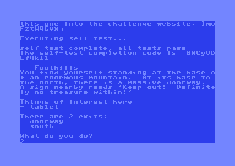
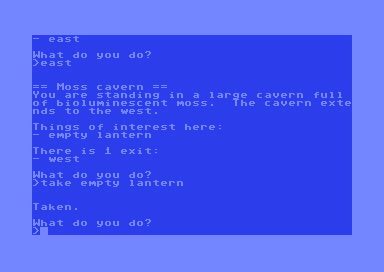

# Synacor VM for the Commodore 64

The Synacor Challenge is a coding challenge by the creator of [Advent of
Code](https://adventofcode.com). The first part of this challenge is to
implement a simple virtual machine, as specified [here](synacor/arch-spec). 

If you're interested in this sort of thing, I'd highly recommend checking it
out! There are some minor spoilers about the challenge below.

Once the VM is up and running, you launch it with the included binary and it
starts a simple text adventure, in the style of Zork. 

I had a lot of fun working through the challenge with a C VM
[implementation](https://github/njm64/synacor), but I was curious to see 
if it would feasible to get it running on the Commodore 64. The VM
specifications are fairly modest, so it felt like it should be possible.

# Screenshots

Here are some screenshots of the VM running on the 
[VICE](https://vice-emu.sourceforge.io) emulator:

# Building

The VM is implemented in 6502 assembly using the 
[KICK assembler](http://www.theweb.dk/KickAssembler/Main.html#frontpage).
To build it, install KICK, and update the path to kickass.jar in the `Makefile`.

The build process also requires a C compiler to build the `makedisk` tool.
This is a custom tool that builds a D64 disk image containing the
`challenge.bin` bytecode and the interpreter.

Run `make`, and this will generate a `synacor.d64` file in the build directory.

The `run` script will launch `synacor.d64` in the VICE emulator. It also loads
symbols from the generated `vm.vs` file, which makes debugging with the
built-in VICE monitor easier.

# Technical Details

## Memory Layout

The `challenge.bin` file is 59914 bytes, which is slightly too big to fit into
the 64KB address space of the C64. We also need to leave space for the
interpreter itself, KERNAL ROM, video RAM, etc. We don't need BASIC ROM, 
so that can be swapped out, allowing us to use an extra 8192 bytes of RAM 
from $A000-$C000.

I ended up implementing a really simple virtual memory system, splitting the
`challenge.bin` data into 256 byte pages, and loading them from disk on
demand.

The overall memory layout looks like this:

- $0002: Virtual machine registers and temporary data in zero page (32 bytes)
- $0801: Interpreter code (1432 bytes)
- $1000: Memory pages mapped from `challenge.bin` (47104 bytes)
- $C800: Virtual machine stack (256 bytes)
- $C900: Input buffer (40 bytes)
- $CA00: Memory mapping tables (768 bytes)

The arch-spec specifies that the stack size is unbounded, but it turns out that
in practice 256 bytes is more than enough. I measured a maximum stack depth of
35 words (70 bytes) when playing the game to completion.

## Decryption

The VM can write to memory, so any pages that are modified need to be locked in
RAM. I added some stats to my C VM implementation to measure the number of
modified pages, and found that it was higher than expected (~99 pages, around
half my physical address space).

It turned out that most of this was due to the code decrypting itself on
startup. I added decryption code to the build process and bypassed the original
decryption function. This brought the number of modified pages down to
10. Much more reasonable!

Another reason for bypassing the original decryption code was performance. It
uses a combination of XOR and multiply operations. Multiplication is slow on
the 6502, as it needs to be done in software.

Matt Keeter's excellent article [Reverse-engineering the Synacor Challenge](https://www.mattkeeter.com/blog/2024-01-28-synacor/index.html) was really helpful
for figuring all this out.

## Disk Layout

Disks formatted for the [1541](https://en.wikipedia.org/wiki/Commodore_1541) 
normally use 35 tracks, where each track holds between 17-21 sectors, and
each sector holds 256 bytes.

The Synacor VM can address 32K words, where each word is 16 bits, so a total
of 64KB. We store the complete VM image on the first 256 sectors of the disk.

Disk layout looks like this:

- Tracks 1-13: `challenge.bin` data (65536 bytes)
- Track 14: `vm.prg` interpreter code (1435 bytes)
- Track 18: Directory track, with a single entry pointing to `vm.prg`

I wasn't able to find an off the shelf tool to write a D64 file containing
raw sector data, so I wrote [makedisk.c](tools/makedisk.c) to do this. I 
also just wanted an excuse to learn more about the layout of 1541 disks.

The `makedisk` tool also performs decryption of `challenge.bin`, and patches
the Teleporter Puzzle (one of the later challenges, where you need to 
reverse engineer and modify the byte code to complete the game).

## Performance

Overall, the game runs fairly well on the Commodore 64, and is certainly
playable. The slowest part is disk access. The maximum transfer speed is around 
[400 bytes per second](http://singularcrew.hu/idedos/perf.php), so there is
a noticeable pause whenever it pages in a 256 byte sector.

